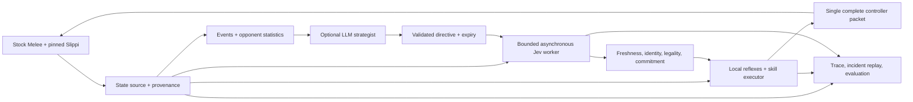
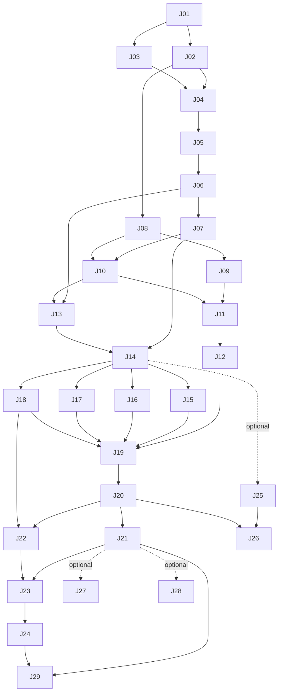

# Jev Melee implementation plan

Research and checkout inspection: 2026-09-21. Repository: **cmoyates/melee**.
Baseline: `b2195989e5c080fb37d4fb76471e2f5b40da257d`, branch `mod/showboat-ai`.

## Outcome and scope

Build an autonomous local Melee player with a deterministic frame executor, asynchronous Jev tactical selection, and an optional slower LLM strategist. The implementation must be runnable, observable and testable by a coding agent without a person operating menus. Start with Fox, Battlefield, items off, Mario CPU level 3 and stock US1.02 game behavior, as selected by the user. Keep the existing Showboat Captain Falcon as a separate historical baseline. The intended later destination is a new Showboat Falcon built on this shared Jev foundation. Verify Fox-specific mechanics and timings; reuse Showboat infrastructure and testing lessons without inheriting Falcon execution assumptions.

This deliverable is a researched implementation backlog, not a claim that its proposed commands or infrastructure already exist. The two user research documents informed it; current upstream documentation and the actual checkout refine their assumptions. No emulator was launched and no paid Jev inference was run while making this plan. Existing issue #1 remains the independent Showboat project.

## Initial research snapshot

| Verified in this session | Implication |
| --- | --- |
| Original and preserved stock `main.dol` both SHA-1 `08e0bf20134dfcb260699671004527b2d6bb1a45` | Reuse the valid local baseline; don't rebuild or source assets unnecessarily. |
| Showboat source, build/verification helpers, capture manifests, analyzer and host-test fixtures | Reuse contracts and lessons; rerun applicable checks when implementation changes, rather than treating historical test counts as a fresh pass. |
| `ftCo_800B3900` calls Showboat around native CPU planning/output | These hooks are internal CPU overlays, not a ready external skill API. |
| Recorder `SR_INTERVAL=12`, version-2 float encoding and historical v1 quarantine | Recorder samples cannot substitute for a per-frame observation stream. Preserve evidence semantics and schema provenance. |
| `/Applications/Dolphin.app` exists; conventional Slippi app path does not | A compatible Slippi runtime is still an unproved prerequisite; no exhaustive installation search was performed. |
| uv, Python, Ninja and GitHub admin access are available | Agent tooling and issue automation can be bootstrapped locally. Keep the existing decomp environment isolated. |
| No `TYPESAFE_API_KEY` in this process environment | Account access is not verified. An implementation session must configure credentials privately; offline work is independent of that prerequisite. |
| Upstream build jobs are partly gated to `doldecomp/melee` | Add dedicated asset-free fork CI rather than relying on upstream status. |

Relevant starting points: `docs/showboat_handoff.md`, `docs/showboat_ai.md`, `tools/showboat_capture.py`, `tools/run_showboat.sh`, `tools/build_showboat.sh`, `tools/verify_showboat.py`, `src/melee/mod/showboat_*.c`, `src/melee/ft/kinds/ftCommon/ftCo_0A01.c`, `src/melee/ft/fighter.c`, `configure.py` and `.github/workflows/`.

## Current implementation checkpoint

The isolated graphical Slippi runtime and supervised match loop are implemented locally; see `agent/RUNTIME_STATUS.md` for evidence. Battlefield is now the default test stage so platform work can proceed. The frame executor is shared by live control and asset-free fake tests. The user supplied `~typesafe/jev-latest`; one authenticated Decisions API probe verified account access and resolved `typesafe/jev-1.13-20260917`, with a typed choice, probabilities and confidence. The initial snapshot above is historical; source-provider pricing and confidence semantics are not verified OpenRouter route guarantees.

## Decisions from current research

1. **Prove the macOS runtime first.** The current libmelee README documents a mainline Slippi macOS crash and suggests Ishiiruka or a nogui build. Its source also shows explicit EXI/runtime restrictions. J03 is a bounded compatibility probe; it must select and pin a working combination. Headless and faster-than-real-time operation are optional capabilities, not prerequisites assumed from the name Dolphin. [Source](https://github.com/vladfi1/libmelee/blob/bce21f09984b286e6d36bfd2939e4cd4691f94c2/README.md)

2. **Use stock Melee for the first bot.** Slippi instrumentation can depend on retail addresses, while this fork supports a shifted executable. A custom DOL is not assumed compatible. J25 tests that hypothesis separately; decomp instrumentation cannot block first live control. The existing Showboat CPU and the external virtual-controller bot remain separate control modes.

3. **Use OpenRouter as requested by the user.** Load `OPENROUTER_API_KEY` privately from `agent/.env` and keep the transport behind a provider-neutral tactical contract. Use `POST /api/alpha/decisions` with `model`, `state` and typed `questions`; Jev rejects chat-completions requests. A live Choice probe verified returned probabilities and confidence; validate these against the submitted candidate set. Disable automatic retries/fallback replay of stale requests, bound total time, and back off future fresh submissions. Use the user-selected `~typesafe/jev-latest` alias, verified on 2026-09-21 as `typesafe/jev-1.13-20260917` on TypeSafe. Preserve both requested and resolved identities in experiment records. Do not substitute another model silently. [Decisions API contract](https://openrouter.ai/docs/api/api-reference/alphadecisions/submit-a-decisions-questions-and-answers-request) · [Selected alias](https://openrouter.ai/~typesafe/jev-latest)

4. **Pin provider behavior.** The model page currently lists `jev-1.13.0`; aliases move. It currently lists text/structured-text input, $0.042/M input tokens, free output and dynamically changing limits of 1,200 requests/minute and 250,000 tokens/second. These are research-time values, not runtime guarantees. Capture the returned model, full usage and actual local latency; enforce shared budgets before sending. Basic account access is now verified by one synthetic Choice request (418 ms, 345 input tokens, 31 output tokens, $0.00001449 reported cost). Sustained latency, account limits and tactical calibration remain untested. [Models](https://docs.typesafe.ai/models)

5. **Keep mechanics and arithmetic in code.** The provider explicitly documents numeric precision, indirection and distracting state as weaknesses. Give Jev meaningful bounded choices, derived geometry and a short event history; don't ask it to reconstruct exact mechanics. [Known limitations](https://docs.typesafe.ai/model-jaggedness/jev-1.13)

6. **Confidence is not a win probability.** TypeSafe confidence is computed from the answer distribution. Measure its relationship to a defined tactical label and live outcomes; don't interpret 0.9 confidence as a 90% chance an attack hits. [Confidence](https://docs.typesafe.ai/confidence)

7. **Treat simulation time and wall time separately.** At the inspected libmelee revision, `Console.step()` flushes pending controller state before reading the next state. Blocking pipes, rollback handling and host stalls affect action timing. J03 measures that behavior and J10 tests it. HTTP never owns the frame loop. [Implementation](https://github.com/vladfi1/libmelee/blob/bce21f09984b286e6d36bfd2939e4cd4691f94c2/melee/console.py)

## Creative control is the product goal

Fox proves the common control and evaluation foundation. After that, Captain Falcon gets a character-specific skill adapter and tested expressive actions on the same foundation; Showboat becomes a personality expressed through those capabilities. Existing issue #1 remains the historical native-overlay implementation and comparison baseline.

The intended interface is a personality description in ordinary language, editable during play: for example, “confident and flashy; bait mistakes, take stylish risks when ahead, and celebrate only when safe.” A validated durable PersonaSpec conditions the slower strategist and Jev's tactical choices. Local skills still perform the precise mechanics. Changing supported stylistic preferences should require no controller-code edit or match restart.

Personality and short-lived strategy are separate: a stock loss or tactical directive timeout must not erase the selected persona. Revisions prevent delayed model responses from reviving an older description. Measure compilation and application latency rather than promise instantaneous changes.

Creative range grows with the available skills. The system can vary spacing, risk, pressure and move preferences immediately once those capabilities exist; a novel technique or celebration still needs implementation and mechanical testing. Report unsupported traits explicitly. J24 proves natural-language personality control with Fox, and J29 includes it in the autonomous demo.

## Runtime boundaries

The initial external player is configured as a virtual human controller. It does **not** inherit native CPU recovery or Showboat's native fallback. Recovery/reflexes must exist locally before claiming a complete player. Native CPU takeover would be a different integration requiring its own ownership proof.

Use one bounded latest-state handoff, one controller writer and a small in-flight provider limit. Every response binds to run/episode/life/context, frame, sequence and candidate set. Revalidate when applied. Use complete controller output with deliberate releases; distinguish intent, queued input, actual flush, acknowledged motion, contact and outcome.

## Ordering and milestones

| Milestone | Work | Exit evidence |
| --- | --- | --- |
| A: autonomous laboratory | J01–J07; J08 can proceed after J02 | One command boots, configures, plays and repeats local matches; reliable basic skills and trustworthy per-frame trace. |
| B: first live Jev loop | J08–J11 | Two-minute real Jev match repeated, with observed useful decisions and measured timing. |
| C: diagnosis and playable mechanics | J12–J19 | Fault-tolerant runtime, incident regression, controlled scenarios, recovery, grounded combat and one aerial. |
| D: measured tactical policy | J20–J21 | Fair baseline comparison and a justified latency/confidence configuration, including negative results. |
| E: adaptation and style | J22–J24 | Validated macro directives, replaceable LLM and measurably distinct styles. |
| F: autonomous handoff | J29 | Fresh-session demo, 100-episode report, resumable commands and explicit external prerequisites. |
| Optional investigations | J25–J28 | Decomp compatibility/enrichment, fan-out and prediction each produce a keep/reject result. |

The native issue dependency graph is authoritative for readiness. Numbers express recommended reading/order, not an artificial total ordering: API work does not wait for emulator troubleshooting; incident tools do not wait for stronger gameplay; optional research does not block J29.

The diagram is a reading aid; the manifest includes additional direct prerequisites, such as the incident report and soak required by final certification.

## Infrastructure that enables autonomy

The proposed CLI is `uv run --project agent melee-agent …`. All commands in the issues are **acceptance interfaces to implement**, not commands asserted to work today.

- **doctor / bootstrap:** capability JSON, pinned dependencies, asset hashes, runtime probe and secure configuration.
- **run / match / stop:** a unique run profile, lease/lock, owned process identity, watchdog, duration/cost limits and lifecycle evidence.
- **skill-check / scenarios:** repeatable starting conditions with explicit success and failure oracles.
- **capture / inspect / explain / replay-incident:** trustworthy logs and deterministic offline reproduction.
- **evaluate / tune:** fixed suites, frozen held-out sets, recorded budgets and comparable results.
- **work ready:** list open issues with all native blockers closed; reconcile the GitHub graph with the local manifest.

Public CI runs synthetic/host tests without private game assets or credentials. Live tests run on the local Mac in an owned profile, invoked on demand. A persistent privileged self-hosted runner processing untrusted public pull requests is not needed.

Use `build/jev/runs/<run-id>/` for local profiles/manifests/captures, separate from `build/showboat/`. Never patch an active virtual disc or stop another application to obtain the test slot. Adapt rather than blindly call libmelee's default temporary-home cleanup: its inspected `Console.stop()` permanently removes a temporary home. Use a persistent owned home with temporary-home mode disabled and recoverable Trash cleanup.

The user's request establishes the objective of unattended execution. Implement a clearly scoped automation profile and reusable run lease rather than repeatedly requesting readiness for each automated match. Existing human/Showboat launch rules are retained for those sessions. Account enrollment, secure credential entry and unavailable original assets remain genuinely human prerequisites. Doctor must report them precisely while independent offline work continues. No budget purchase or credential sharing is implied by this plan.

## Evidence and completion rules

For each implementation issue: take a narrow branch/PR, add the smallest end-to-end change, run its offline checks and stated live acceptance, inspect artifacts, and attach a sanitized result with commit/build/model/config identity. Do not close a live issue from mocks alone. A blocked account or runtime is a blocked live check, not a green skip.

Record wall time, simulation frame, request age, attempted/accepted/acknowledged actions, fallback reasons and spend. Raw assets, DOLs, ISO files, savestates, credentials and raw captures stay out of Git/GitHub artifacts. Preserve historical reports; removed paths go to macOS Trash using absolute paths.

Mechanical reliability and playing strength are different gates. An experiment can complete with a negative result, but the final report must say whether Jev improves over a scripted selector with the same executor and observations. CPU results include matchup/level/sample size and uncertainty. A replay supports observed-state analysis; it cannot prove the future after a hypothetical different action.

Long runs have explicit duration, episode, request, token, monetary and disk budgets. Exhaustion produces a report and resumes only from recorded progress; no silent endless retries or automatic purchases. Hard real-time guarantees are not claimed for Python/macOS; actual timing and watchdog behavior are measured.

## Deferred scope

Multiple characters/stages, public online play, a native PC port, Jev fine-tuning, a new trained local policy, large combo libraries and custom Dolphin transport are outside the first core milestone. The optional telemetry probe can identify a transport gap, but that gap does not become a prerequisite for the stock-runtime bot. The planned next character is Captain Falcon: first validate its skills on the shared runtime, then add expressive skills and the Showboat persona. Further mechanical work is guided by both requested creative capabilities and measured gameplay failures.

## Sources

- [Checkout and Showboat handoff](https://github.com/cmoyates/melee/blob/b2195989e5c080fb37d4fb76471e2f5b40da257d/docs/showboat_handoff.md)
- [Current libmelee setup and macOS caveat](https://github.com/vladfi1/libmelee/blob/bce21f09984b286e6d36bfd2939e4cd4691f94c2/README.md)
- [Inspected libmelee frame/transport implementation](https://github.com/vladfi1/libmelee/blob/bce21f09984b286e6d36bfd2939e4cd4691f94c2/melee/console.py)
- [libmelee menu automation](https://github.com/vladfi1/libmelee/blob/bce21f09984b286e6d36bfd2939e4cd4691f94c2/melee/menuhelper.py)
- [TypeSafe HTTP API](https://docs.typesafe.ai/api)
- [TypeSafe async Python client](https://docs.typesafe.ai/sdk/python/api/clients/async)
- [TypeSafe retry controls](https://docs.typesafe.ai/sdk/python/api/retries)
- [TypeSafe model versions and limits](https://docs.typesafe.ai/models)
- [TypeSafe confidence semantics](https://docs.typesafe.ai/confidence)
- [Jev 1.13 known limitations](https://docs.typesafe.ai/model-jaggedness/jev-1.13)
- [TypeSafe speculative fan-out](https://docs.typesafe.ai/patterns/fan-out)
- [GitHub native issue dependencies](https://docs.github.com/en/rest/issues/issue-dependencies)
- [GitHub sub-issues](https://docs.github.com/en/rest/issues/sub-issues)

GitHub roadmap: https://github.com/cmoyates/melee/issues/2

## GitHub issue index

| Slice | Issue | Blocked by | Track |
| --- | --- | --- | --- |
| J01 | [#3 Bootstrap an isolated agent workspace and machine-readable doctor](https://github.com/cmoyates/melee/issues/3) | None | Foundation |
| J02 | [#4 Run a complete fake frame-to-controller slice in asset-free CI](https://github.com/cmoyates/melee/issues/4) | #3 | Foundation |
| J03 | [#5 Prove and pin a macOS Slippi/libmelee runtime with one input round trip](https://github.com/cmoyates/melee/issues/5) | #3 | First autonomous match |
| J04 | [#6 Supervise owned emulator runs with locks, watchdog and recoverable cleanup](https://github.com/cmoyates/melee/issues/6) | #5, #4 | First autonomous match |
| J05 | [#7 Automate local match setup, result detection and the next match](https://github.com/cmoyates/melee/issues/7) | #6 | First autonomous match |
| J06 | [#8 Capture trustworthy per-frame observations and applied controller provenance](https://github.com/cmoyates/melee/issues/8) | #7 | First autonomous match |
| J07 | [#9 Execute observed movement, jump and shield skills through one controller owner](https://github.com/cmoyates/melee/issues/9) | #8 | First autonomous match |
| J08 | [#10 Integrate Jev behind a deadline-aware typed adapter and mock transport](https://github.com/cmoyates/melee/issues/10) | #4 | Jev connection |
| J09 | [#11 Benchmark Jev from this machine and select an honest initial cadence](https://github.com/cmoyates/melee/issues/11) | #10 | Jev connection |
| J10 | [#12 Keep the live frame loop running under delayed and reordered policy results](https://github.com/cmoyates/melee/issues/12) | #9, #10 | Jev connection |
| J11 | [#13 Complete the first live Jev-controlled two-minute CPU match](https://github.com/cmoyates/melee/issues/13) | #11, #12 | Jev connection |
| J12 | [#14 Prove failure recovery and watchdog behavior in a bounded live soak](https://github.com/cmoyates/melee/issues/14) | #13 | Reliable experimentation |
| J13 | [#15 Turn a run trace into a deterministic incident report and offline regression](https://github.com/cmoyates/melee/issues/15) | #8, #12 | Reliable experimentation |
| J14 | [#16 Create repeatable mechanical scenarios with declared setup and outcome oracles](https://github.com/cmoyates/melee/issues/16) | #9, #15 | Playable mechanics |
| J15 | [#17 Recover and defend locally without cloud decisions](https://github.com/cmoyates/melee/issues/17) | #16 | Playable mechanics |
| J16 | [#18 Execute grounded attacks and grabs with observed completion](https://github.com/cmoyates/melee/issues/18) | #16 | Playable mechanics |
| J17 | [#19 Execute one short-hop aerial with landing and interruption handling](https://github.com/cmoyates/melee/issues/19) | #16 | Playable mechanics |
| J18 | [#20 Compile semantic observations and build a leakage-resistant decision corpus](https://github.com/cmoyates/melee/issues/20) | #16 | Playable mechanics |
| J19 | [#21 Assemble a complete Jev tactical player on one character and stage](https://github.com/cmoyates/melee/issues/21) | #14, #17, #18, #19, #20 | Playable mechanics |
| J20 | [#22 Run reproducible policy tournaments and produce an honest strength report](https://github.com/cmoyates/melee/issues/22) | #21, #15 | Measured improvement |
| J21 | [#23 Calibrate Jev action selection, confidence gates and delay tolerance](https://github.com/cmoyates/melee/issues/23) | #22, #11 | Measured improvement |
| J22 | [#24 Track opponent tendencies and prove a time-limited macro directive](https://github.com/cmoyates/melee/issues/24) | #22, #20 | Strategy and style |
| J23 | [#25 Add a replaceable LLM strategist with measured incremental value](https://github.com/cmoyates/melee/issues/25) | #24, #23 | Strategy and style |
| J24 | [#26 Expose reproducible playing styles and an explanation of adaptation](https://github.com/cmoyates/melee/issues/26) | #24, #25 | Strategy and style |
| J25 | [#27 Test shifted-DOL compatibility and export one useful decomp field](https://github.com/cmoyates/melee/issues/27) | #8, #16 | Optional |
| J26 | [#28 Consume versioned enriched telemetry and measure its value](https://github.com/cmoyates/melee/issues/28) | #27, #22 | Optional |
| J27 | [#29 Measure speculative branch decisions under real latency](https://github.com/cmoyates/melee/issues/29) | #23 | Optional |
| J28 | [#30 Evaluate bounded response-time state prediction](https://github.com/cmoyates/melee/issues/30) | #23 | Optional |
| J29 | [#31 Certify a one-command autonomous demo and resumable development workflow](https://github.com/cmoyates/melee/issues/31) | #14, #15, #23, #26 | Autonomous handoff |
